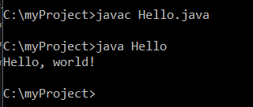

> **NOTE:** This README.md file should be placed at the **root of each of your repos directories.**
>
>Also, this file **must** use Markdown syntax, and provide project documentation as per below--otherwise, points **will** be deducted.
>
>

# LIS 4368 - Advanced Web Applications Development

## Michael Gunter

### Assignment #1 Requirements:

**Three Parts:*
1. Distributed Version Control with Git and Bitbucket
2. Java/JSP/Servlet Development installation
3. Chapter Questions (Chs 1 - 4)

#### README.md file should include the following items:

Bullet-list items
* Screenshot of running java Hello (#1 above)
* Screenshot of successful Apache Tomcat installation
* Bitbucket repo links

1. git init - initializes git repository (creates .git folder)
2. git status - shows state of the present directory; shows if changes have been staged
3. git add - includes stages to the index
4. git commit - stores the changes to the repository
5. git push - pushes changes made from the local repository to the remote repository
6. git pull - fetch and integrate changes from a remote repository
7. git log - shows a detailed list of the commits that were made previously.

#### Assignment Screenshots:

*Screenshot of running java Hello*:

*Screenshot of Tomcat running http://localhost:9999*:

#### Tutorial Links:

*Bitbucket Tutorial - Station Locations:*
[A1 Bitbucket Station Locations Tutorial Link](https://bitbucket.org/mgunt/bitbucketstationlocations "Bitbucket Station Locations")

*Tutorial: Request to update a teammate's repository:*
[A1 My Team Quotes Tutorial Link](https://bitbucket.org/mgunt/myteamquotes "My Team Quotes Tutorial")
