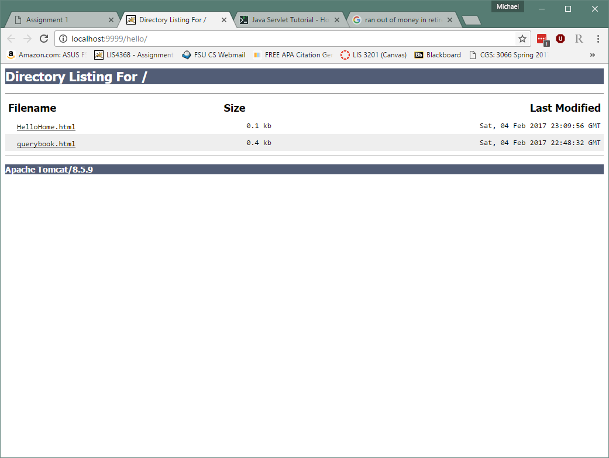
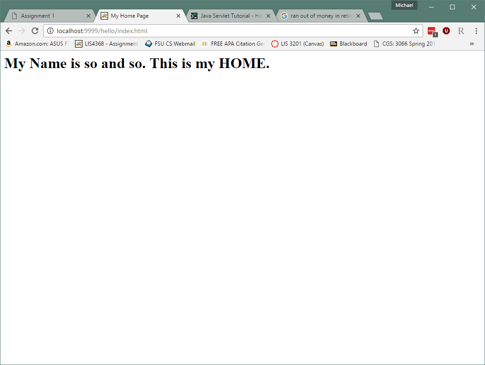
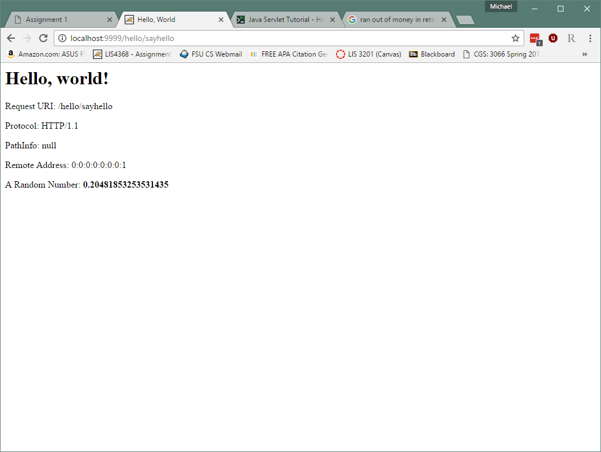
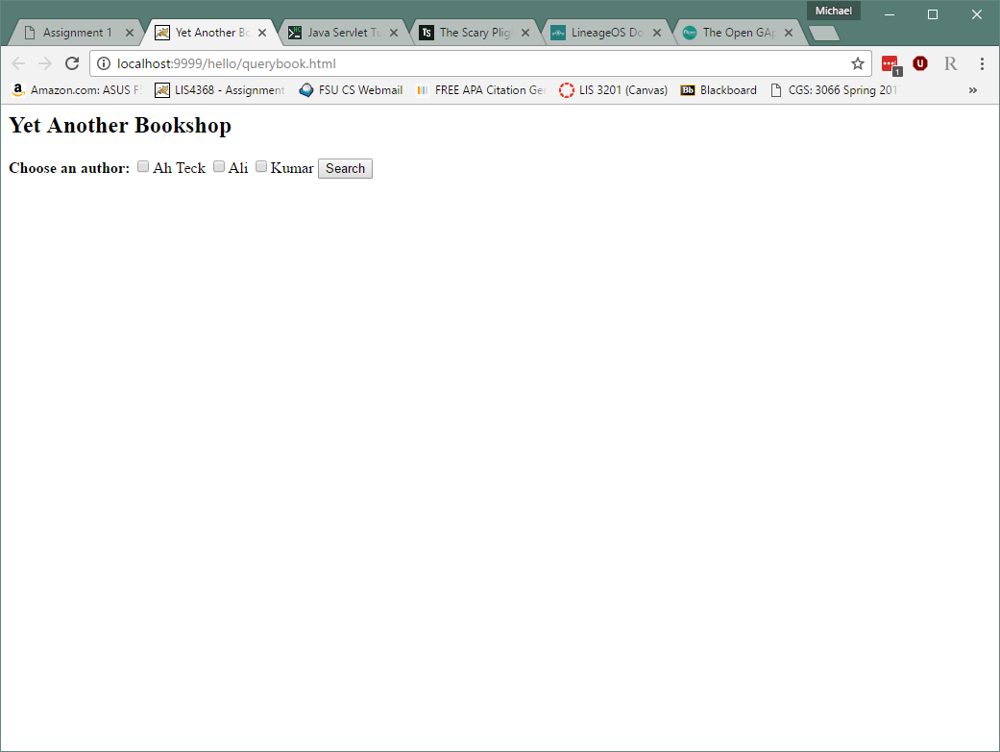
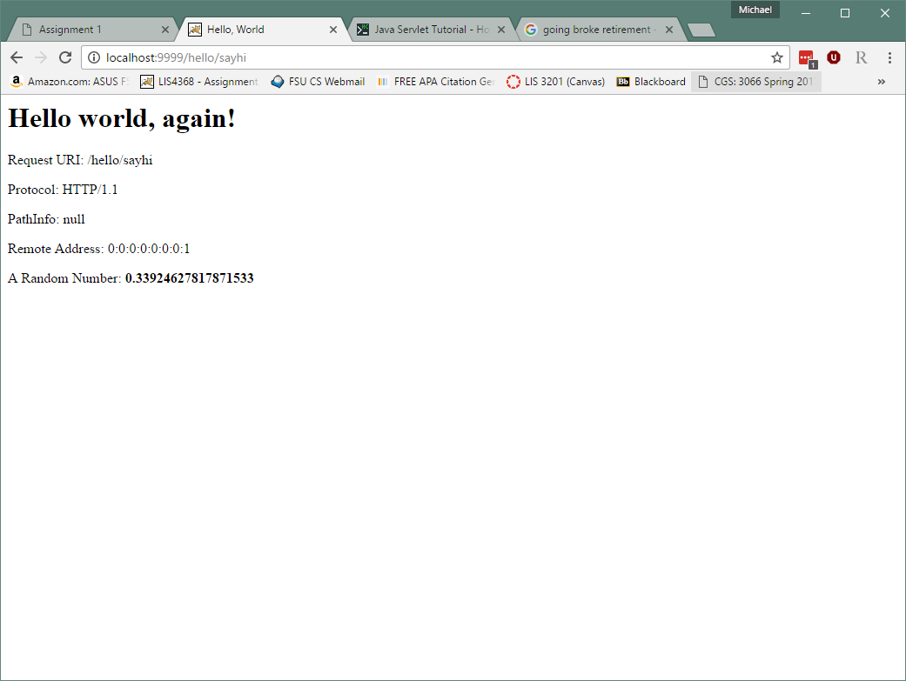
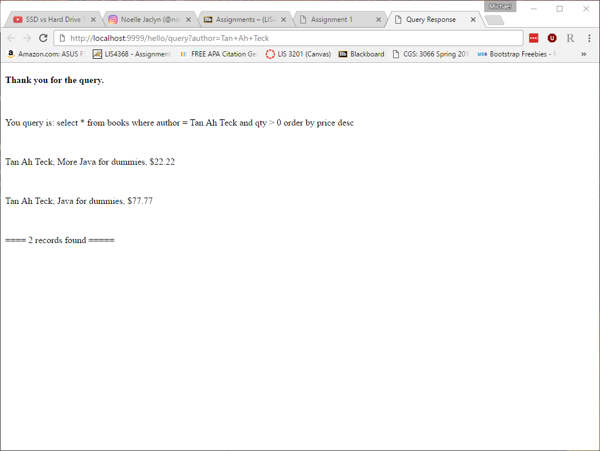

> **NOTE:** This README.md file should be placed at the **root of each of your repos directories.**
>
>Also, this file **must** use Markdown syntax, and provide project documentation as per below--otherwise, points **will** be deducted.
>
>

# LIS 4368 - Advanced Web Applications Development

## Michael Gunter

### Assignment #2 Requirements:

**Two Parts:**
1. MySQL Installation
2. JSP/Servlet Screenshots

#### README.md file should include the following items:

* Screenshot of hello directory
* Screenshot of HelloHome.html
* Screenshot of sayhello (HelloServlet)
* Screenshot of querybook.html
* Screenshot of sayhi servlet
* Screenshot of query result set

#### Assignment Screenshots:

*Screenshot of hello directory*:

*Screenshot of HelloHome.html*:

*Screenshot of sayhello*:

*Screenshot of querybook.html*:

*Screenshot of sayhi*:

*Screenshot of query result set*:

