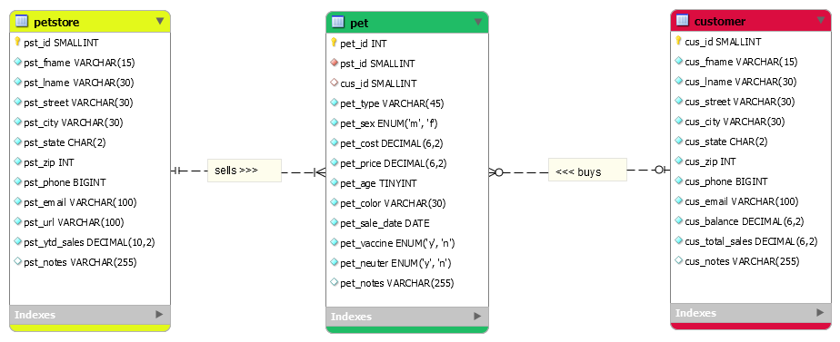

> **NOTE:** This README.md file should be placed at the **root of each of your repos directories.**
>
>Also, this file **must** use Markdown syntax, and provide project documentation as per below--otherwise, points **will** be deducted.
>
>

# LIS 4368 - Advanced Web Applications Development

## Michael Gunter

### Assignment #3 Requirements:

**Two Parts:**
1. MySQL ERD
2. SQL Statements

#### README.md file should include the following items:

* Link of A3 Entity Relationship Diagram
* Link of A3 SQL Statements

#### Assignment Links:

*Link of a3.mwb*:

[a3.mwb](./a3.mwb)

*Link of a3.sql*:

[a3.sql](./a3.sql)

*Screenshot of ERD*:

