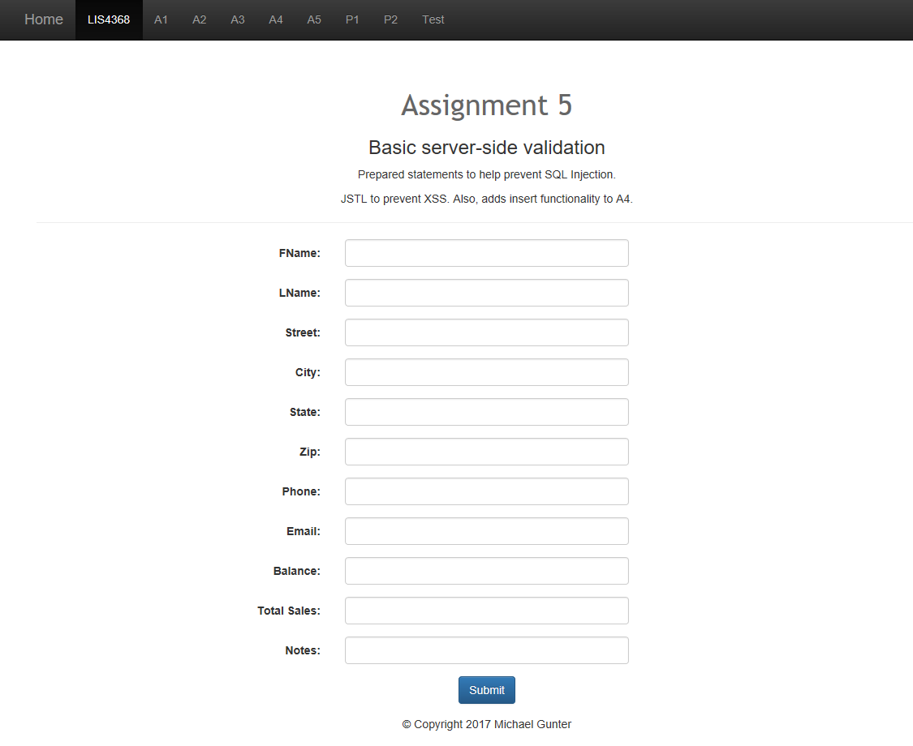
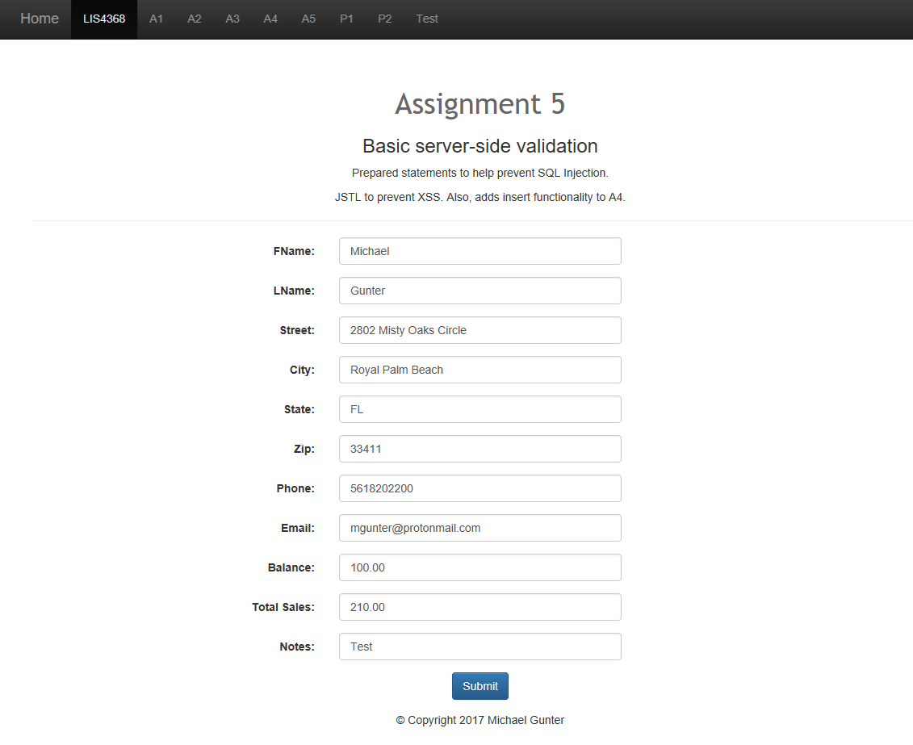
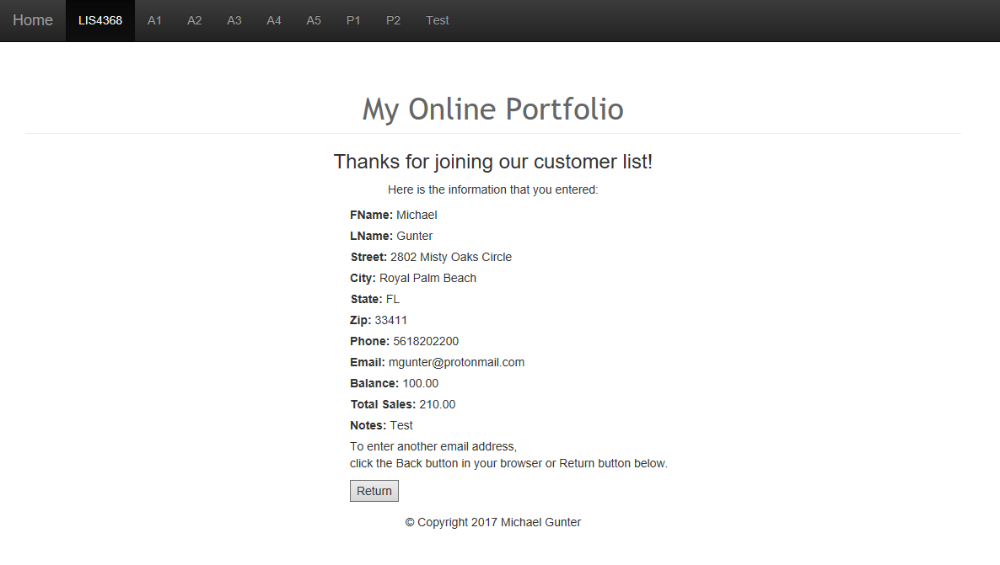

> **NOTE:** This README.md file should be placed at the **root of each of your repos directories.**
>
>Also, this file **must** use Markdown syntax, and provide project documentation as per below--otherwise, points **will** be deducted.
>
>

# LIS 4368 - Advanced Web Applications Development

## Michael Gunter

### Assignment #5 Requirements:

1. Server-side Form Validation

#### README.md file should include the following items:

* Screenshot of Valid User Form Entry
* Screenshot of Passed Form Validation

#### Assignment Links:

*Screenshot of pre-valid form entry*:

*Screenshot of Valid User Form Entry*:

*Screenshot of Passed Form Validation*:

