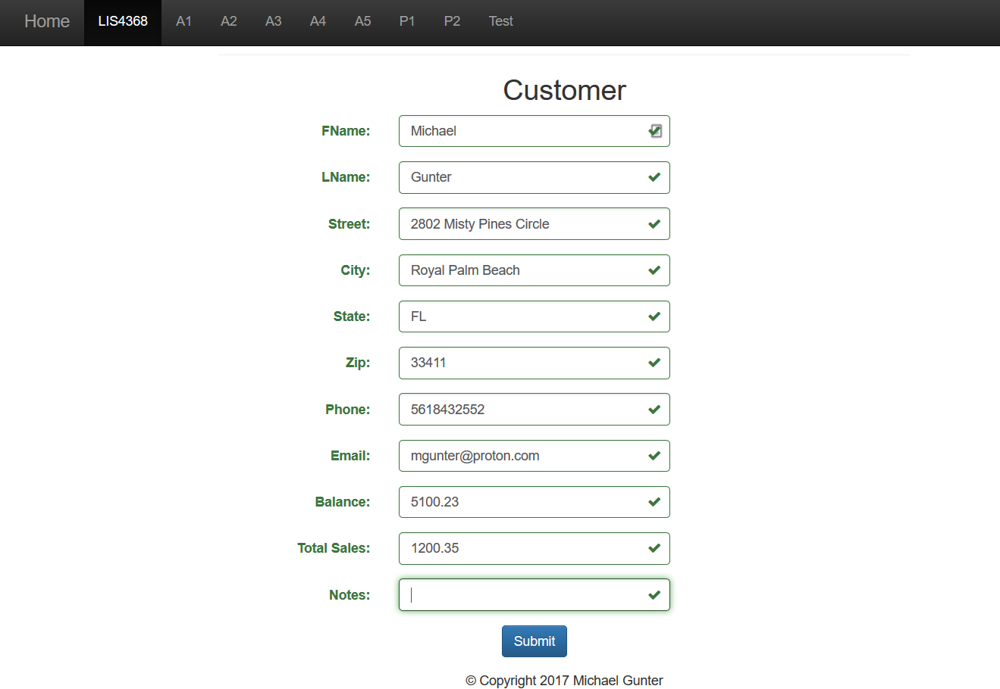
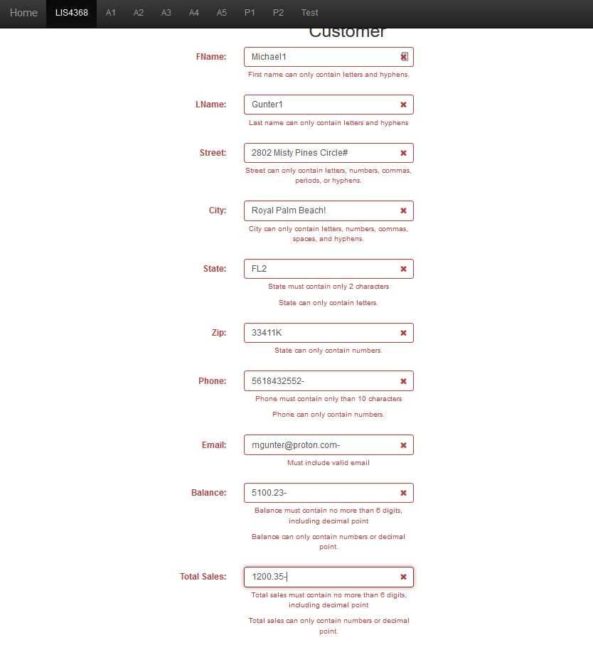

> **NOTE:** This README.md file should be placed at the **root of each of your repos directories.**
>
>Also, this file **must** use Markdown syntax, and provide project documentation as per below--otherwise, points **will** be deducted.
>
>

# LIS 4368 - Advanced Web Applications Development

## Michael Gunter

### Project #1 Requirements:

**Two Parts:**
1. jQuery Form Validation
2. Remote Repos

#### README.md file should include the following items:

* Link of index.jsp
* Screenshot of valid data
* Screenshot of invalid data

#### Assignment Links:

*Link of index.jsp*:

[index.jsp](./index.jsp)

### Valid and Invalid data

*Screenshot of valid data:

*Screenshot of invalid data:

