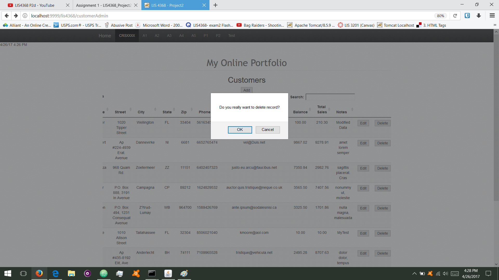

> **NOTE:** This README.md file should be placed at the **root of each of your repos directories.**
>
>Also, this file **must** use Markdown syntax, and provide project documentation as per below--otherwise, points **will** be deducted.
>
>

# LIS 4368 - Advanced Web Applications Development

## Michael Gunter

### Project #2 Requirements:

**Two Parts:**
1. Server-side validation
2. CRUD Functionality

#### README.md file should include the following items:

* Screenshot of Valid User Form Entry
* Screenshot of Passed Validation
* Screenshot of Display Data
* Screenshot of Modify Form (customer.jsp)
* Screenshot of Modify Form (modify.jsp)
* Screenshot of Modified Data (modify.jsp)
* Screenshot of Modified Data (customer.jsp)
* Screenshot of Delete Warning (modify.jsp)

#### Assignment Links:

*Link of customerform.jsp*:

[customerform.jsp?assign_num=p2](../customerform.jsp?assign_num=p2)

### Valid and Invalid data

*Screenshot of valid user form entry:

*Screenshot of passed validation:

*Screenshot of display data:

*Screenshot of modify form (modify.jsp):

*Screenshot of modified form (customer.jsp):

*Screenshot of delete warning (modify.jsp):

*Screenshot of database entries (dbentry.jsp):

